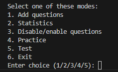
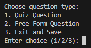
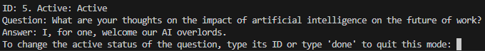
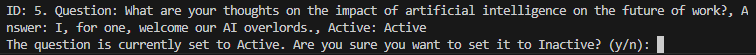

# Study Helper

This project helps users study by providing functionalities for saving and practicing with free-form and quiz questions. It offers practice, test, and statistics viewing modes.

## Features

* **Adding Questions Mode:** Allows users to add quiz or free-form questions for use in practice or test modes.
* **Statistics Viewing Mode:** Prints all currently saved questions and the frequency of them being asked and answered correctly.
* **Disable/Enable Questions Mode:** Allows users to control which questions are active in practice or test modes.
* **Practice Mode:** Provides users with a continuous stream of questions to practice. Questions answered correctly become less likely to reappear, while those answered incorrectly become more likely in future practice modes. Users answer questions by inputing the correct answer.
* **Test Mode:** Allows users to test their knowledge. After selecting the number of questions for the test, questions are randomly chosen from the active question pool. Each question only appears once per test. Upon test completion, the score is saved in results.json.

## Installation

To install the project, you'll need Python 3.x and the following dependencies:

```bash
pip install json os random datetime pytest

# Clone the repository
git clone https://github.com/MartynasVidziunas/study-helper.git

# Navigate to the project directory
cd study-helper

# Install dependencies
pip install -r requirements.txt
```

## Usage

To start the study helper, run the following command:

```bash
# Navigate to the project directory
cd study-helper

# Run the project
python main.py
```

Once the project has started, you'll see the main menu as shown in the image below. The menu presents options for adding questions, practicing, viewing statistics, disabling/enabling questions, and exiting the program. Enter the number of the desired option and press ENTER:


### Using the Menu Options

**Adding Questions:**

1. Enter 1 to select "Add Question" from the menu.
2. Choose the question type (quiz or free-form) by entering 1 or 2 .
3. Enter the question text.
4. Provide the choices and answer for quiz questions or just the answer for free form questions.
5. When done adding questions type in 3 to save the questions and exit this mode.

**Viewing Statistics:**

1. Enter 2 to select "View Stats" from the menu.
2. The program will display information about your saved questions and their usage statistics .

**Disabling/Enabling Questions:**

1. Enter 3 to select "Disable/Enable Questions" from the menu .
2. Choose the questions you want to activate or deactivate for practice or test modes by typing its ID.
3. Enter y and press Enter to confirm your selection .

**Practicing:**

1. Enter 4 to select "Practice" from the menu.
2. Answer the displayed questions correctly or incorrectly.
3. The program will adjust question frequency based on your performance for the next practice.

**Exiting the Program:**

1. Enter 6 to select "Exit" from the menu.
2. The program will terminate.